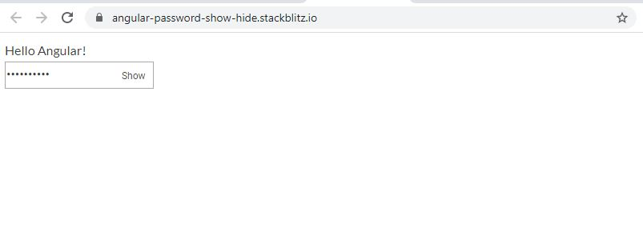

# angular-password-show-hide
angular-password-show-hide
this is angular password show hide directive you can use directly  by adding "appPasswordShowHide" on an input like below 

    

To preview demo of Angular-password-show-hide directive, [click here](https://angular-password-show-hide.stackblitz.io/)
<input type = password value="inputcompo" appPasswordShowHide/>

